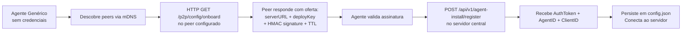

# Plano de Implementação — Rede Privada P2P por ClientId + Transferência por Manifesto e Cache em Arquivo Completo

> Data: 2026-05-13
> Status: Rascunho para aprovação
> Escopo: isolamento lógico da malha P2P por clientId + otimização de transferência por manifesto/chunks +
> namespace de descoberta e roteamento coerente para cliente/site

---

## Sumário Executivo

O Discovery Agent já implementa transferência de arquivos P2P via libp2p com chunking,
swarm download, gossip e seed plan. O ajuste decidido para a próxima etapa é:

1. usar `clientId` como eixo inicial de isolamento da malha P2P
2. manter o runtime mais leve, sem adicionar criptografia em disco nesta fase
3. alinhar gossip, onboarding e DHT ao mesmo namespace lógico por `clientId`
4. deixar shared key por cliente como endurecimento futuro opcional

Este plano começa pelo isolamento lógico por `clientId` e evolui para cache de
manifesto, cache local em arquivo completo, protocolo Want-Have e DHT namespaced por `clientId`.

---

## Arquitetura do Isolamento

```
┌─────────────────────────┐     ┌─────────────────────────┐
│  Cliente A              │     │  Cliente B              │
│  clientId: client-a     │     │  clientId: client-b     │
│                         │     │                         │
│  ┌───┐  ┌───┐  ┌───┐   │     │  ┌───┐  ┌───┐  ┌───┐   │
│  │A1 │◄─►│A2 │◄─►│A3 │   │     │  │B1 │◄─►│B2 │◄─►│B3 │   │
│  └───┘  └───┘  └───┘   │     │  └───┘  └───┘  └───┘   │
│     ▲                    │     │     ▲                    │
│     │ namespace client-a │     │     │ namespace client-b │
│     ▼                    │     │     ▼                    │
│  ┌──────────────┐        │     │  ┌──────────────┐        │
│  │  filtro de   │        │     │  │  filtro de   │        │
│  │  peers por   │        │     │  │  peers por   │        │
│  │  clientId    │        │     │  │  clientId    │        │
│  └──────────────┘        │     │  └──────────────┘        │
└─────────────────────────┘     └─────────────────────────┘
           │                               │
           │       ┌─────────────┐         │
           └──────►│  Servidor   │◄────────┘
                   │  Central    │
                   │             │
                   │ Distribui   │
                   │ clientId +  │
                   │ siteId por  │
                   │ agente      │
                   └─────────────┘
```

**Comunicação entre clientes:** peers com `clientId` diferente podem até ser detectados
na mesma LAN, mas não entram na mesma malha lógica, não trocam catálogo útil e não
participam da mesma rota de distribuição.

---

## Fase 1 — Isolamento Lógico por ClientId

### 1.1 Fonte canônica do isolamento

O identificador primário da malha privada será `clientId`, já presente em
`AgentConfiguration`.

Arquivo de referência: `src/app/agent_config.go`

```go
type AgentConfiguration struct {
    ...
    SiteID   string `json:"siteId"`
    ClientID string `json:"clientId"`
    ...
}
```

### 1.2 Propagação do clientId até o runtime P2P

O `p2pCoordinator` deve iniciar o provider de discovery/transfer com o `clientId`
resolvido da configuração vigente.

Arquivo: `src/app/p2p_libp2p.go`

```go
func (p *p2pLibP2PProvider) Start(
    ctx context.Context,
    self p2pSelfEndpoint,
    onPeer func(peer p2pDiscoveredPeer),
    onTrace func(string),
    clientID string,
) error {
    clientID = strings.TrimSpace(strings.ToLower(clientID))
    if clientID == "" {
        return fmt.Errorf("clientId ausente para inicializacao do provider P2P")
    }
    ...
}
```

### 1.3 Handshake de identidade com clientId

O handshake libp2p atual deve passar a carregar também o `clientId`.

```go
type p2pLibP2PPeerInfo struct {
    AgentID  string `json:"agentId"`
    ClientID string `json:"clientId"`
    HTTPPort int    `json:"httpPort"`
}
```

Regras de aceitação de peer:

1. se `remote.ClientID != localClientID`, o peer é rejeitado
2. o peer não entra no registry
3. o peer não é emitido para `onPeer`
4. gossip e transfers só acontecem depois dessa validação

Exemplo:

```go
if !strings.EqualFold(strings.TrimSpace(remote.ClientID), localClientID) {
    if onTrace != nil {
        onTrace(fmt.Sprintf("peer rejeitado por clientId divergente: peer=%s clientId=%s esperado=%s",
            strings.TrimSpace(remote.AgentID), strings.TrimSpace(remote.ClientID), localClientID))
    }
    _ = s.Reset()
    return
}
```

### 1.4 Pontos onde o filtro por clientId deve existir

| Arquivo | Mudança |
|---|---|
| `src/app/p2p_libp2p.go` | handshake inbound/outbound passa a carregar e validar `clientId` |
| `src/app/p2p_discovery.go` | interface de provider recebe `clientId` |
| `src/app/p2p.go` | `p2pCoordinator.Run()` passa `agentCfg.ClientID` ao provider |
| `src/app/p2p_gossip.go` | ignorar peers/artifacts com `clientId` divergente |
| `src/app/p2p_nats_discovery.go` | rejeitar snapshots com `clientId` divergente |
| `src/app/p2p_cloud_bootstrap.go` | incluir e validar `clientId` no bootstrap |

### 1.5 Consequências para discovery

- **mDNS/LAN probe**: peers de outros clientes ainda podem aparecer na LAN, mas são descartados
  antes de virarem peers válidos do cluster.
- **NATS discovery snapshot**: o servidor deve filtrar por `clientId`, e o agente deve revalidar.
- **Cloud bootstrap**: mesma regra; `clientId` precisa entrar no payload e na validação local.

### 1.6 Descoberta acelerada por evento de peer online

Para acelerar a descoberta de agentes que acabaram de entrar online, o agent deve escutar
eventos por cliente no barramento:

1. escutar subject por cliente: `tenant.{clientId}.p2p.events`
2. filtrar somente mensagens com `eventType = peer.online`

Validação obrigatória antes de tentar conectar:

1. `clientId` da mensagem igual ao `clientId` local
2. `agentId` diferente do próprio agent (ignorar self)
3. `peerId` não vazio
4. `addrs` com pelo menos um endereço válido
5. `port > 0`

Dedupe recomendado:

1. chave de dedupe: `agentId` (ou `peerId`)
2. janela de debounce: 5 segundos para agrupar bursts

Payload JSON recomendado:

```json
{
  "eventType": "peer.online",
  "clientId": "guid-do-cliente",
  "siteId": "guid-do-site",
  "agentId": "guid-do-agente",
  "peerId": "12D3KooW...",
  "addrs": ["10.0.0.5", "192.168.1.20"],
  "port": 41090,
  "generatedAtUtc": "2026-05-13T14:10:00Z"
}
```

Exemplo conceitual de consumo:

```go
subject := fmt.Sprintf("tenant.%s.p2p.events", localClientID)
subscribe(subject, func(msg PeerEventMessage) {
    if msg.EventType != "peer.online" {
        return
    }
    if !strings.EqualFold(strings.TrimSpace(msg.ClientID), localClientID) {
        return
    }
    if strings.EqualFold(strings.TrimSpace(msg.AgentID), localAgentID) {
        return
    }
    if strings.TrimSpace(msg.PeerID) == "" || msg.Port <= 0 || !hasValidAddr(msg.Addrs) {
        return
    }
    if debounceSeen(msg.AgentID, 5*time.Second) {
        return
    }
    attemptConnect(msg.PeerID, msg.Addrs, msg.Port)
})
```

Esse caminho não substitui mDNS/snapshot/bootstrap; ele complementa para reduzir latência
de descoberta após subida de novos agents.

### 1.7 Operação com clientId ausente

Para manter onboarding funcional:

1. agente genérico sem credenciais pode rodar apenas o fluxo mínimo de onboarding
2. a malha P2P principal só sobe quando `clientId` estiver disponível
3. em ambiente produtivo, peer sem `clientId` válido não entra no cluster

### 1.8 Evolução futura para shared key por cliente

O plano inicial **não** usa `go-libp2p-pnet`. Futuramente, uma shared key por `clientId`
pode ser adicionada como endurecimento opcional do transporte, sem reabrir o desenho
da malha:

```go
// Fase futura opcional:
// clientId continua sendo o namespace lógico
// sharedSecret entra apenas como hardening de transporte
if cfg.SharedSecret != currentSecret {
    p.restartProviderWithPSK(agentCfg.ClientID, cfg.SharedSecret)
}
```

---

## Impacto no Zero-Touch Config Registration

### Como o onboarding funciona hoje

O Zero-Touch Config Registration permite que um agente sem credenciais obtenha
configuração automaticamente de peers já configurados na mesma LAN.



### O que muda com o isolamento por clientId

| Etapa do onboarding | Impacto | Motivo |
|---|---|---|
| mDNS descobre peers | Nenhum | mDNS não depende de `clientId` |
| `GET /p2p/health` | Nenhum | HTTP local direto |
| `GET /p2p/config/onboard` | Nenhum | HTTP local direto |
| registro no servidor | Nenhum | servidor entrega `clientId` na configuração resolvida |
| entrada na malha P2P | Sim | exige restart do coordinator com `clientId` agora conhecido |

### Cenário operacional esperado

1. agente genérico descobre peer configurado
2. recebe oferta de onboarding via HTTP
3. registra no servidor
4. persiste `AuthToken`, `AgentID`, `ClientID`
5. reinicia o provider P2P com o `clientId` definitivo
6. entra na malha correta do cliente

### Risco de onboarding cruzado entre clientes

Um agente genérico pode receber ofertas HTTP de peers de clientes diferentes na mesma LAN.
Isso não quebra o modelo porque:

1. o servidor é a autoridade final do vínculo
2. o agente só entra na malha correspondente ao `clientId` recebido
3. peers com `clientId` divergente são descartados depois do onboarding

### Ajuste recomendado

Após `registerWithDeployKey()`, reiniciar imediatamente o coordinator com o `clientId`
persistido, para evitar esperar o próximo ciclo natural de refresh.

```go
func (c *p2pCoordinator) onZeroTouchCompleted() {
    agentCfg := c.app.GetAgentConfiguration()
    if strings.TrimSpace(agentCfg.ClientID) != "" {
        c.restartProvider(agentCfg.ClientID)
    }
}
```

---

## Fase 2 — Transferência por Manifesto + Cache em Arquivo Completo

### Contexto: como o manifesto é gerado hoje

Antes de detalhar a Fase 2, é importante entender o fluxo desejado de obtenção do artifact:

```mermaid
flowchart TD
    A[Agent precisa obter o artifact X] --> B{Router P2P ativo?}
    B -->|Não| C[Consulta URL do artifact no servidor]
    B -->|Sim| D[b"0. Lista artifacts locais"]
    D --> E{Tem local?}
    E -->|Sim| F[Retorna arquivo local ao chamador]
    E -->|Não| G[b"1. Gossip: pergunta aos peers"]
    G --> H{Achou em<br>≥1 peer?}
    H -->|Não| I{Ja existe peer<br>fazendo upstream fetch?}
    I -->|Sim| J[Aguarda lease ativo<br>ou progresso remoto]
    I -->|Não| K[Tenta assumir lease<br>de upstream fetch]
    K -->|Lease obtido| L[Consulta URL do artifact no servidor]
    K -->|Lease perdido| J
    H -->|Sim| J{b"≥2 peers<br>com o artifact?"}
    J -->|Não| M[b"2. Pede ACCESS a 1 peer<br>3. Baixa arquivo inteiro"]
    J -->|Sim| N[b"2. Pede ACCESS a cada peer"]
    N --> O[b"3. Pede MANIFEST ao peer"]
    O --> P[b"Peer SERVIDOR:<br>buildChunkManifest()<br>lê arquivo e gera manifest"]
    P --> Q[b"4. downloadChunkedLibp2p()<br>distribui chunks entre peers"]
    Q --> R[b"5. Monta arquivo final<br>6. Verifica SHA-256"]
    M --> R
    C --> S{Download da URL<br>do servidor funcionou?}
    L --> S
    J --> U{Artifact ficou<br>disponível na rede?}
    U -->|Sim| N
    U -->|Não, lease expirou| K
    S -->|Sim| T[Valida hash, salva arquivo local<br>e anuncia disponibilidade]
    S -->|Não| V[Publica falha e libera lease]
    T --> W[Retorna arquivo ao chamador]
    R --> W
    V --> X[Retorna falha de obtenção]
    X --> W
```

**Conclusão importante:** o manifesto já existe hoje e é gerado sob demanda pelo peer
que possui o artifact. Não há etapa separada de pré-geração obrigatória.

**Regra operacional proposta para obtenção do artifact:**

1. tentar obter o artifact via peers do grupo local (aqueles alcançáveis via gossip do mesmo `clientId`)
2. se nenhum peer do grupo tiver o arquivo, iniciar eleição local de fetcher
3. o fetcher eleito publica heartbeat via gossip scoped no grupo
4. antes de baixar da URL do servidor, o fetcher tenta lock global no servidor
5. se obtiver lock global, baixa o artifact da URL
6. se não obtiver lock (outro grupo já está baixando), aguarda disponibilidade do artifact via peers
7. se o download da URL falhar, libera lock global e lease local, retorna erro
8. após concluir download com sucesso, validar hash, gerar/validar manifesto, publicar no servidor e anunciar `available`

O processo de instalação não faz parte desta fase: a camada P2P apenas entrega um arquivo local
válido ou um erro de obtenção, e outra tratativa decide o que fazer em seguida.

Idealmente a API deve devolver uma URL canônica e temporária do artifact, junto com metadados
de integridade como nome esperado, tamanho e SHA-256 final.

Diretriz sobre manifesto do servidor:

1. é interessante sim o agent consultar manifesto no servidor quando existir manifesto canônico válido
2. se o manifesto do servidor não existir ou estiver desatualizado, o agent usa o manifesto local gerado após download
3. após gerar/validar manifesto local, o agent envia esse manifesto ao servidor para otimizar os próximos downloads

Modelo recomendado: estratégia híbrida (server-first com fallback local).

### 2.1 Coordenação de upstream fetch em dois escopos

A coordenação precisa funcionar em dois níveis: local (dentro do grupo P2P) e global (entre grupos).

#### Eleição local de fetcher dentro do grupo

Cada grupo P2P que precisar de um artifact deve eleger exatamente um peer para ser o fetcher.
A eleição usa o gossip como canal de comunicação entre peers do mesmo grupo/clientId.
A decisão é baseada em score de capacidade de hardware, não em primeiro a responder.

Fluxo de eleição:

1. todo peer elegível que precisa do artifact publica sua candidatura via gossip contendo `AgentID`, `cpuCores`, `ramGB`, `cpuPercent`, `memPercent`
2. todos os candidatos recebem as candidaturas dos demais e calculam o score local de cada um (combinando núcleos livres, RAM livre e peso igual entre CPU e memória)
3. cada candidato descobre os valores máximos do grupo (`maxCpuCores`, `maxRamGB`) a partir das candidaturas recebidas
4. quem tiver o maior score assume o estado `fetching` e publica o heartbeat de lease
5. os demais reconhecem o vencedor e não tentam buscar a URL
6. em caso de empate, o menor `AgentID` (ordem lexicográfica) desempata

#### Publicação local do heartbeat via gossip

O fetcher eleito publica seu estado em um tópico de gossip consumido por todos os peers
do mesmo `clientId`. Isso garante que o grupo inteiro saiba do progresso sem depender de
um canal central.

O heartbeat do lease é publicado exclusivamente nesse escopo local:

```go
scopedGossipTopic := "/discovery/fetch/" + clientID + "/" + artifactID

// fetcher publica heartbeat
gossip.Publish(scopedGospTopic, ArtifactFetchHeartbeat{
    ArtifactID:  artifactID,
    ClientID:    clientID,
    OwnerPeerID: localPeerID,
    Status:      "fetching",
    LeaseUntil:  time.Now().Add(90 * time.Second),
    ProgressPct: 45.0,
    UpdatedAt:   time.Now(),
})

// demais peers consomem e validam
gossip.Subscribe(scopedGossipTopic, func(msg ArtifactFetchHeartbeat) {
    if msg.OwnerPeerID != localPeerID && msg.Status == "fetching" {
        // reconhece que alguém está baixando, não disputa
    }
})
```

#### Lock global no servidor

O servidor expõe um endpoint de lock global por `clientId + artifactId` para evitar
que múltiplos grupos baixem o mesmo artifact em paralelo.

Fluxo:

1. fetcher local tenta lock global antes de contatar a URL
2. se obtiver o lock, baixa e publica heartbeat normalmente
3. se não obtiver, aguarda disponibilidade e tenta obter de peers
4. ao concluir ou falhar, libera o lock

```go
func acquireGlobalLock(ctx context.Context, artifactID, clientID string) (bool, error) {
    resp, err := http.Post(fmt.Sprintf("%s/p2p/lock", serverURL), ...)
    if err != nil {
        return false, err
    }
    return resp.StatusCode == 200, nil
}

func releaseGlobalLock(artifactID, clientID string) {
    http.Delete(fmt.Sprintf("%s/p2p/lock/%s/%s", serverURL, clientID, artifactID))
}
```

#### Estados do artifact no grupo local

- `missing`: ninguém possui e ninguém está baixando no grupo
- `fetching`: alguém do grupo assumiu o lease local
- `available`: o artifact já está disponível no grupo
- `failed`: a última tentativa no grupo falhou

#### Regras propostas

1. apenas um fetcher local por grupo para cada artifact
2. fetcher publica heartbeat local via gossip tópico scoped
3. antes de baixar da URL, fetcher tenta lock global no servidor
4. se não obtiver lock global, aguarda disponibilidade pelos peers
5. se o heartbeat local expirar, outro peer do grupo pode disputar a eleição
6. peer sobrecarregado não participa da eleição local
7. lock global expira com TTL próprio, independente do lease local

#### Critério de elegibilidade e prioridade por capacidade

Além de estar abaixo dos limiares de sobrecarga, a eleição deve priorizar
máquinas com mais capacidade de hardware para assumir o fetch.

A prioridade é calculada localmente com base em um score composto:

1. núcleos de CPU disponíveis (mais núcleos, maior score)
2. memória RAM total disponível (mais memória, maior score)
3. ambos ajustados pelo percentual de uso no momento

Score de capacidade:

```
score = (coresLivres / maxCoresDoGrupo * 0.5) + (memoriaLivreGB / maxMemoriaDoGrupo * 0.5)
```

A máquina com maior score vence a eleição.
O denominador (`maxCoresDoGrupo`, `maxMemoriaDoGrupo`) é descoberto via gossip
durante a candidatura — cada candidato anuncia seu hardware no payload de candidatura.

Fluxo de eleição com prioridade:

1. cada candidato publica sua candidatura contendo `AgentID`, `cpuCores`, `ramGB`, `cpuPercent`, `memPercent`
2. todos os candidatos elegíveis recebem as candidaturas dos demais
3. cada um calcula o score local de todos os candidatos
4. quem tem o maior score assume o estado `fetching`
5. se houver empate, o menor `AgentID` (lexicográfico) desempata

Exemplo da struct de candidatura:

```go
type ArtifactFetchCandidate struct {
    ArtifactID string  `json:"artifactId"`
    ClientID   string  `json:"clientId"`
    AgentID    string  `json:"agentId"`
    CPUCores   int     `json:"cpuCores"`
    RAMGB      float64 `json:"ramGb"`
    CPUPercent float64 `json:"cpuPercent"`
    MemPercent float64 `json:"memPercent"`
}

type ArtifactFetchScore struct {
    AgentID string
    Score   float64
}

func computeScore(candidate ArtifactFetchCandidate, maxCPUCores int, maxRAMGB float64) float64 {
    coresFree := float64(candidate.CPUCores) * (100 - candidate.CPUPercent) / 100
    ramFreeGB := candidate.RAMGB * (100 - candidate.MemPercent) / 100

    coreScore := coresFree / float64(maxCPUCores) * 0.5
    ramScore  := ramFreeGB / maxRAMGB * 0.5

    return coreScore + ramScore
}
```

Critérios de elegibilidade:

1. só participa da eleição quem estiver abaixo dos limiares de sobrecarga
2. CPU < 70%, memória < 85%, disco < 80%
3. entre os elegíveis, vence quem tiver maior score de capacidade
4. scores são calculados localmente por cada candidato com base nos dados de gossip

#### Exemplo conceitual do estado

```go
type ArtifactFetchState struct {
    ArtifactID   string
    ClientID     string
    Status       string
    OwnerPeerID  string
    LeaseUntil   time.Time
    ProgressPct  float64
}

func canStartLocalElection(state ArtifactFetchState, now time.Time, loadOK bool) bool {
    if state.Status == "available" {
        return false
    }
    if state.Status == "fetching" && now.Before(state.LeaseUntil) {
        return false
    }
    return loadOK
}
```

### 2.2 Heartbeat e renovação do lease

O heartbeat de lease é publicado pelo fetcher no tópico scoped de gossip do artifact,
consumido por todos os peers do grupo dentro do mesmo `clientId`.

Via de publicação:
```
gossip.Publish("/discovery/fetch/" + clientID + "/" + artifactID, heartbeat)
```

Isso garante que todos os peers conectados ao grupo vejam o heartbeat sem depender
de rota centralizada.

Parâmetros iniciais recomendados:

1. lease TTL: 90 segundos
2. heartbeat periódico: a cada 15 segundos
3. janela de tolerância: considerar perda do lease após 90 segundos sem renovação válida
4. critério adicional: se houver heartbeat sem avanço relevante por toda a janela do lease, considerar lease estagnado

Campos mínimos do heartbeat:

```go
type ArtifactFetchHeartbeat struct {
    ArtifactID  string    `json:"artifactId"`
    ClientID    string    `json:"clientId"`
    OwnerPeerID string    `json:"ownerPeerId"`
    Status      string    `json:"status"`
    LeaseUntil  time.Time `json:"leaseUntil"`
    ProgressPct float64   `json:"progressPct"`
    UpdatedAt   time.Time `json:"updatedAt"`
}
```

Observação: métricas de host (CPU/memória/disco) ficam fora do heartbeat do lease.
A decisão de elegibilidade para assumir ou renovar lease continua local ao agent,
usando o policy de carga já definido no plano.

Semântica do heartbeat:

1. cada heartbeat renova o `LeaseUntil` se o peer continuar elegível
2. se o peer entrar em sobrecarga local, ele não renova e deve liberar a liderança
3. se os outros peers não receberem heartbeat válido dentro do TTL, o lease expira
4. se o progresso ficar parado por toda a janela do lease, o fetch pode ser considerado abandonado
5. se o peer concluir o download, o último heartbeat/publicação troca o estado para `available`

Proteção contra split-brain:

1. heartbeat só é aceito se `UpdatedAt` for mais novo que o último estado conhecido do mesmo owner
2. um peer que perdeu o lease não deve continuar anunciando `fetching`
3. qualquer fetch retomado depois da expiração precisa disputar um novo lease explicitamente

Problemas atuais:

1. o manifesto nunca é cacheado
2. cada pedido de manifesto pode reler o arquivo inteiro
3. artifacts baixados por URL só ganham manifesto quando alguém pede
4. não existe coordenação explícita para evitar downloads duplicados da URL do servidor

### 2.3 Cache do Manifest

O seed que recebeu o artifact deve gerar e cachear o manifesto logo após o primeiro download:

```go
manifest, _ := buildChunkManifest(path, artifactID, chunkSize)
saveCachedManifest(manifestDir, artifactName, manifest)
```

Estrutura sugerida:

```
tempDir/
    p2p-cache/
        manifests/
            MyApp-1.2.3.exe.json
            discovery-agent-2.5.0.exe.json
        files/
            MyApp-1.2.3.exe
            discovery-agent-2.5.0.exe
```

No serving path:

```go
func handleStreamArtifactManifest(s network.Stream, ...) {
    if manifest := loadCachedManifest(manifestDir, req.ArtifactName); manifest != nil {
        _ = json.NewEncoder(s).Encode(manifest)
        return
    }
    manifest, _ := buildChunkManifest(path, ...)
    saveCachedManifest(manifestDir, req.ArtifactName, manifest)
    _ = json.NewEncoder(s).Encode(manifest)
}
```

### 2.3.1 Fluxo pós-download para integridade e publicação de manifesto

Quando o artifact for obtido da URL do servidor (ou reconstituído via peers), o agent deve
seguir um pipeline único antes de anunciar disponibilidade no cluster:

1. validar SHA-256 do arquivo final
2. carregar manifesto existente local, se houver
3. se não houver manifesto válido, gerar manifesto local a partir do arquivo final
4. validar consistência entre arquivo final e manifesto (tamanho, chunk size, ordem e hash final)
5. persistir manifesto no cache local
6. publicar manifesto no servidor central para reaproveitamento por outros agents
7. anunciar artifact como `available` na malha P2P

Exemplo conceitual:

```go
func finalizeDownloadedArtifact(path string, artifactID string) error {
    if err := verifyFileSHA256(path, expectedSHA256); err != nil {
        return err
    }

    manifest := loadCachedManifest(manifestDir, artifactID)
    if manifest == nil || !manifestMatchesFile(manifest, path) {
        generated, err := buildChunkManifest(path, artifactID, defaultChunkSize)
        if err != nil {
            return err
        }
        manifest = generated
    }

    if err := saveCachedManifest(manifestDir, artifactID, manifest); err != nil {
        return err
    }
    if err := publishManifestToServer(artifactID, manifest); err != nil {
        return err
    }
    return announceArtifactAvailable(artifactID)
}
```

Política de consulta de manifesto (ordem recomendada):

1. tentar manifesto canônico do servidor quando o endpoint estiver saudável
2. em falha de rede/latência/ausência de manifesto, usar cache local
3. se cache local também não existir, gerar manifesto local on-demand
4. após geração local, sincronizar para o servidor de forma assíncrona

### 2.4 Armazenamento por arquivo completo

Além do cache de manifesto, o artifact baixado deve ser persistido localmente como
um arquivo final completo, e não como partes armazenadas separadamente.

As partes continuam existindo no fluxo de transferência de rede para permitir download
paralelo e retomada, mas o formato persistido em disco deve ser o arquivo completo,
porque isso simplifica validação, limpeza e reuso local por outras camadas do agent.

```
tempDir/
  p2p-cache/
    manifests/
      MyApp-1.2.3.exe.json
    files/
      MyApp-1.2.3.exe
      discovery-agent-2.5.0.exe
```

O manifesto continua guardando:

- nome do artifact
- versão
- tamanho total
- chunk size
- SHA-256 final do arquivo
- lista ordenada dos pedaços para transferência

### 2.5 Paralelismo dinâmico de download

O número de partes baixadas em simultâneo não deve ser fixo. Embora hoje o comportamento
prático possa operar com um paralelismo baixo e relativamente estático, o plano futuro deve
tratar isso de forma adaptativa conforme a carga local da máquina.

Diretriz proposta:

1. se CPU, memória e disco estiverem com folga, o agent aumenta o número de partes em download simultâneo
2. se a máquina estiver em carga moderada, o agent mantém um nível intermediário de paralelismo
3. se a máquina estiver sobrecarregada, o agent reduz a concorrência para preservar responsividade local

Sinais mínimos para decisão:

- uso de CPU do host
- pressão de memória disponível
- atividade de disco ou fila de I/O

Limites iniciais recomendados para esta fase:

1. download mínimo: 2 partes simultâneas
2. download padrão: 4 partes simultâneas
3. download máximo: 8 partes simultâneas
4. serving mínimo: 0 partes ofertadas quando o host estiver sobrecarregado
5. serving padrão: até 2 partes ofertadas em paralelo
6. serving máximo: até 4 partes ofertadas em paralelo

Exemplo conceitual:

```go
type TransferLoadSnapshot struct {
    CPUPercent        float64
    MemoryPercent     float64
    DiskBusyPercent   float64
}

func decideDownloadParallelism(load TransferLoadSnapshot) int {
    switch {
    case load.CPUPercent < 45 && load.MemoryPercent < 70 && load.DiskBusyPercent < 50:
        return 8
    case load.CPUPercent < 70 && load.MemoryPercent < 85 && load.DiskBusyPercent < 75:
        return 4
    default:
        return 2
    }
}
```

Os números acima são o ponto de partida recomendado para a primeira entrega. O objetivo da fase
é introduzir um scheduler adaptativo, com limites mínimo e máximo configuráveis, em vez de um valor fixo global.

Mas, após concluir o download, o agent materializa e mantém no cache apenas o arquivo final:

```go
artifactPath := filepath.Join(cacheDir, "files", sanitizeArtifactName(artifactName))
tmpPath := artifactPath + ".partial"

if err := os.MkdirAll(filepath.Dir(artifactPath), 0o755); err != nil {
    return err
}

if err := assembleChunksIntoFile(tmpPath, manifest, downloadedParts); err != nil {
    return err
}

if err := verifyFileSHA256(tmpPath, manifest.SHA256); err != nil {
    return err
}

if err := os.Rename(tmpPath, artifactPath); err != nil {
    return err
}
```

Quando outra camada do agent precisar consumir ou servir o artifact novamente, o agent usa
diretamente esse arquivo completo do cache, sem precisar remontar tudo outra vez.

### 2.6 Benefícios

- implementação mais simples e previsível
- alinhamento com o fluxo atual de materialização em arquivo final
- resumabilidade mais barata durante a transferência
- reuso direto do artifact já materializado por outras camadas
- menor custo operacional do que manter índice global de hashes
- base pronta para protocolo Want-Have
- paralelismo ajustado à capacidade real do host
- menos releitura de arquivos grandes para servir manifestos

### 2.7 Garbage Collection

Worker periódico remove artifacts completos órfãos não referenciados por manifests ativos.

```go
func (c *p2pCoordinator) runContentGC(ctx context.Context) {
    ticker := time.NewTicker(p2pCoordinatorCleanupTickHours)
    defer ticker.Stop()
    for {
        select {
        case <-ctx.Done():
            return
        case <-ticker.C:
            c.collectOrphanArtifacts()
        }
    }
}
```

---

## Fase 3 — Protocolo Want-Have (Opcional)

### 3.1 Motivação

O gossip atual envia catálogo completo de artifacts. Em clientes com muitos agents
e muitos artifacts, isso gera tráfego desnecessário.

### 3.2 Protocolo simplificado

Novo protocolo libp2p: `/artifact/want/1.0.0`

```go
type WantHaveRequest struct {
    ArtifactID string `json:"artifactId"`
    WantParts  []int  `json:"wantParts"`
}

type WantHaveResponse struct {
    ArtifactID string `json:"artifactId"`
    HaveParts  []int  `json:"haveParts"`
}
```

### 3.3 Fluxo

1. peer A quer baixar artifact X
2. consulta manifesto e obtém a lista ordenada de partes do arquivo
3. pergunta a peers válidos do mesmo `clientId` quem tem cada parte
4. distribui o download das partes conforme disponibilidade
5. se ninguém tiver, usa fallback já existente

### 3.4 Oferta condicionada à carga do peer

Um peer não deve oferecer partes para outros peers apenas porque possui o artifact. A oferta
também precisa considerar a carga local da máquina no momento da resposta.

Diretriz proposta:

1. peer com carga baixa pode oferecer mais partes simultaneamente
2. peer com carga moderada oferece poucas partes por janela
3. peer sobrecarregado não oferece partes naquele momento, mesmo tendo o artifact completo

Limites iniciais recomendados para oferta:

1. host com carga baixa: ofertar até 4 partes simultaneamente
2. host com carga moderada: ofertar até 2 partes simultaneamente
3. host sobrecarregado: ofertar 0 partes até a carga normalizar

Isso evita que uma máquina com uso alto de CPU, memória ou disco degrade o usuário local
apenas para servir transferências P2P.

Exemplo conceitual:

```go
func canServePartsNow(load TransferLoadSnapshot) bool {
    return load.CPUPercent < 75 && load.MemoryPercent < 85 && load.DiskBusyPercent < 80
}

func advertisedPartsForPeer(allParts []int, load TransferLoadSnapshot) []int {
    if !canServePartsNow(load) {
        return nil
    }
    return selectWindowByCapacity(allParts, load)
}
```

O protocolo Want-Have pode usar isso de duas formas:

1. responder com lista vazia de partes quando o peer estiver indisponível por carga
2. anunciar apenas uma janela reduzida de partes quando a máquina estiver parcialmente ocupada

### 3.5 Integração com o swarm atual

O `downloadChunkedLibp2p` já distribui chunks por peer. O Want-Have adiciona
uma negociação mais granular por partes do arquivo, reaproveitando a estrutura de manifesto.

---

## Fase 4 — DHT Namespaced por ClientId (Escalabilidade)

### 4.1 Quando usar

A DHT é útil quando:

- o cliente tem muitos agents e o gossip O(n²) começa a escalar mal
- existem redes sem broadcast eficiente
- há necessidade de descoberta de provedor com menos dependência do catálogo completo

### 4.2 Implementação

```go
import dht "github.com/libp2p/go-libp2p-kad-dht"

prefix := protocol.ID("/discovery/dht/" + normalizeClientID(clientID))

kdht, err := dht.New(ctx, h,
    dht.Mode(dht.ModeServer),
    dht.ProtocolPrefix(prefix),
    dht.BootstrapPeers(bootstrapPeers),
)
```

### 4.3 Namespace por clientId

O prefixo do protocolo DHT é derivado diretamente do `clientId`, garantindo que
clientes diferentes nunca compartilhem a mesma DHT lógica:

```go
func normalizeClientID(value string) string {
    return strings.TrimSpace(strings.ToLower(value))
}

dhtPrefix := "/discovery/dht/" + normalizeClientID(clientID)
```

O `siteId` pode futuramente virar um subnamespace operacional dentro do mesmo cliente,
mas não será o eixo principal de isolamento.

---

## Fase 5 — Telemetria Enriquecida para Coordenação P2P

### 5.1 Motivação

A telemetria atual enviada ao servidor (`POST /p2p-telemetry`) contém apenas métricas
agregadas (contadores de replicação, bytes servidos, etc.). Para suportar as Fases 1–4,
o servidor precisa saber:

- Quais artifacts cada agent possui em cache → alimentar `p2p_artifact_presence`
- Carga de hardware do host → eleição de fetcher e paralelismo dinâmico
- Capacidade total do host → score de capacidade na eleição
- Quantos peers estão ativos/conectados → saúde do mesh

### 5.2 Campos novos no payload de telemetria

```go
type P2PTelemetryRequest struct {
    AgentID        string                   `json:"agentId,omitempty"`
    SiteID         string                   `json:"siteId,omitempty"`
    CollectedAtUtc string                   `json:"collectedAtUtc"`
    Metrics        P2PMetrics               `json:"metrics"`
    CurrentSeedPlan P2PSeedPlan             `json:"currentSeedPlan"`

    // ── NOVOS ──
    Artifacts      []P2PArtifactPresenceItem `json:"artifacts,omitempty"`
    HostLoad       *P2PHostLoad             `json:"hostLoad,omitempty"`
    KnownPeers     int                      `json:"knownPeers"`
    ConnectedPeers int                      `json:"connectedPeers"`
}

type P2PArtifactPresenceItem struct {
    ArtifactID   string `json:"artifactId"`   // Guid do WingetPackage.Id ou AppPackage.Id
    ArtifactName string `json:"artifactName"`
    Sha256       string `json:"sha256"`
    SizeBytes    int64  `json:"sizeBytes"`
    CachedAtUtc  string `json:"cachedAtUtc,omitempty"` // mtime do arquivo
}

type P2PHostLoad struct {
    CPUCores        int     `json:"cpuCores"`        // runtime.NumCPU()
    RamGB           float64 `json:"ramGb"`           // mem.VirtualMemory().Total / 1e9
    CPUPercent      float64 `json:"cpuPercent"`      // cpu.Percent(0, false)
    MemoryPercent   float64 `json:"memoryPercent"`   // mem.VirtualMemory().UsedPercent
    DiskBusyPercent float64 `json:"diskBusyPercent"` // disk.IOCounters() delta
}
```

### 5.3 Coleta dos dados no Agent

| Campo | Fonte | Observação |
|-------|-------|------------|
| `HostLoad.CPUCores` | `runtime.NumCPU()` | Estático, coletado uma vez |
| `HostLoad.RamGB` | `mem.VirtualMemory().Total / 1e9` | gopsutil, atualizado a cada coleta |
| `HostLoad.CpuPercent` | `cpu.Percent(0, false)` | Percentual médio desde última chamada |
| `HostLoad.MemoryPercent` | `mem.VirtualMemory().UsedPercent` | Instantâneo |
| `HostLoad.DiskBusyPercent` | `disk.IOCounters()` delta entre ticks | Média de todos os discos físicos |
| `Artifacts[]` | `ListP2PArtifacts()` + `buildArtifactView()` | Truncado a 500 itens |
| `KnownPeers` | `len(p2pCoord.peers)` | Total no registry |
| `ConnectedPeers` | `len(libp2pHost.Network().Peers())` | Conexões libp2p ativas |

### 5.4 Função de coleta de carga

```go
func (c *p2pCoordinator) collectHostLoad() P2PHostLoad {
    load := P2PHostLoad{
        CPUCores: runtime.NumCPU(),
    }

    if vmem, err := mem.VirtualMemory(); err == nil {
        load.RamGB = float64(vmem.Total) / 1e9
        load.MemoryPercent = vmem.UsedPercent
    }

    if cpuPercent, err := cpu.Percent(0, false); err == nil && len(cpuPercent) > 0 {
        load.CPUPercent = cpuPercent[0]
    }

    // Disco: delta entre duas leituras com 1s de intervalo
    io1, _ := disk.IOCounters()
    time.Sleep(1 * time.Second)
    io2, _ := disk.IOCounters()
    if len(io1) > 0 && len(io2) > 0 {
        var totalBusy float64
        for name, c2 := range io2 {
            if c1, ok := io1[name]; ok {
                delta := c2.IoTime - c1.IoTime
                totalBusy += float64(delta) / 10.0 // ms → percent (1s = 1000ms, /10 = %)
            }
        }
        load.DiskBusyPercent = math.Min(totalBusy, 100.0)
    }

    return load
}
```

### 5.5 Montagem do payload de telemetria (função completa)

```go
func (c *p2pCoordinator) buildTelemetryPayload() P2PTelemetryRequest {
    cfg := c.app.GetDebugConfig()
    p2pCfg := c.app.GetP2PConfig()

    req := P2PTelemetryRequest{
        AgentID:        strings.TrimSpace(cfg.AgentID),
        CollectedAtUtc: time.Now().UTC().Format(time.RFC3339),
        Metrics:        c.snapshotMetrics(),
        CurrentSeedPlan: c.currentSeedPlan(),
        KnownPeers:     c.countKnownPeers(),
        ConnectedPeers: c.countConnectedLibp2pPeers(),
    }

    // Artifacts locais (truncado a 500)
    artifacts, _ := c.app.ListP2PArtifacts()
    if len(artifacts) > 500 {
        artifacts = artifacts[:500]
    }
    for _, a := range artifacts {
        req.Artifacts = append(req.Artifacts, P2PArtifactPresenceItem{
            ArtifactID:   a.ArtifactID,
            ArtifactName: a.ArtifactName,
            Sha256:       a.ChecksumSHA256,
            SizeBytes:    a.SizeBytes,
            CachedAtUtc:  a.ModifiedAtUTC,
        })
    }

    // Carga do host (se P2P estiver habilitado)
    if p2pCfg.Enabled {
        load := c.collectHostLoad()
        req.HostLoad = &load
    }

    return req
}

func (c *p2pCoordinator) countKnownPeers() int {
    c.mu.RLock()
    defer c.mu.RUnlock()
    return len(c.peers)
}

func (c *p2pCoordinator) countConnectedLibp2pPeers() int {
    h, _ := c.libp2pHostAndRegistry()
    if h == nil {
        return 0
    }
    return len(h.Network().Peers())
}
```

### 5.6 Envio da telemetria

O envio já existe hoje via `POST /api/agent-auth/me/p2p-telemetry` a cada 5 minutos.
A função `buildTelemetryPayload()` substitui a montagem atual. O resto do fluxo
(serialização JSON, HTTP POST, tratamento de rate limit) permanece igual.

### 5.7 Truncamento de artifacts

Para evitar payloads excessivos (cada item tem ~200 bytes), o array `artifacts` é
truncado a 500 itens (~100 KB). O servidor deve considerar que a ausência de um
artifact na lista NÃO significa que ele foi removido — apenas que não coube no
truncamento. A limpeza de `p2p_artifact_presence` é feita pelo job de TTL (2h),
não pela omissão no payload.

### 5.8 Benefícios para o ecossistema

- **Eleição de fetcher (Fase 2):** `HostLoad` alimenta o score de capacidade sem
  depender exclusivamente de gossip entre peers
- **Paralelismo dinâmico (Fase 2):** `HostLoad.CPUPercent` e `MemoryPercent` são
  usados pelo scheduler adaptativo de download
- **Dashboard de operações:** `KnownPeers` e `ConnectedPeers` permitem alertas
  de desconexão do mesh
- **`p2p_artifact_presence`:** Alimentado diretamente pela telemetria, sem
  depender de fonte complementar
- **Auditoria:** `HostLoad` histórico permite correlacionar degradação de
  performance P2P com carga do host

### 5.9 Plano de validação adicional

| # | Teste |
|---|-------|
| 13 | Payload de telemetria inclui `artifacts[]` com até 500 itens |
| 14 | Payload de telemetria inclui `hostLoad` com CPU, RAM e disco |
| 15 | `hostLoad.DiskBusyPercent` entre 0 e 100 |
| 16 | `connectedPeers` <= `knownPeers` |
| 17 | Servidor faz upsert de `p2p_artifact_presence` a partir do `artifacts[]` |
| 18 | Servidor armazena `hostLoad` na tabela de telemetria |
| 19 | Heartbeat inclui `peerId`, `addrs`, `port` |
| 20 | Servidor publica `peer.online` ao detectar transicao Offline->Online no heartbeat |
| 21 | `POST /p2p/bootstrap` removido |

---

## Fase 6 — Heartbeat P2P (Substitui Bootstrap HTTP)

### 6.1 Motivação

O agente envia heartbeat periódico via NATS. Em vez de ter um endpoint HTTP separado
para registro de peer (`POST /p2p/bootstrap`), o próprio heartbeat carrega os dados
de endereçamento do peer, eliminando a necessidade de HTTP para descoberta P2P.

### 6.2 Mudanças no heartbeat

```go
// Em agent_types.go ou similar
type AgentHeartbeat struct {
    // ── Campos existentes ──
    AgentID        string    `json:"agentId"`
    ClientID       string    `json:"clientId"`
    SiteID         string    `json:"siteId"`
    TimestampUtc   time.Time `json:"timestampUtc"`
    CPUPercent     float64   `json:"cpuPercent"`
    MemoryPercent  float64   `json:"memoryPercent"`
    // ... demais campos ...

    // ── NOVOS ──
    PeerID  string   `json:"peerId,omitempty"`   // libp2p peer ID (12D3KooW...)
    Addrs   []string `json:"addrs,omitempty"`    // IPs roteáveis
    Port    int      `json:"port,omitempty"`     // porta libp2p (41080-41120)
}
```

### 6.3 Fluxo

1. Agent envia heartbeat com `peerId`, `addrs`, `port` (mesmo subject, mesmo intervalo)
2. Servidor processa heartbeat normalmente (liveness, cache Redis)
3. Servidor detecta transição Offline→Online (chave Redis não existia antes)
4. Servidor publica `peer.online` em `tenant.{clientId}.p2p.events`
5. Demais agents do cliente recebem o evento (com debounce de 5s) e conectam via libp2p

### 6.4 Remoção do endpoint HTTP

| Componente | Ação |
|------------|------|
| `p2p_api.go` | Remover `callCloudBootstrapAPI()` e `runCloudBootstrap()` |
| `p2p_cloud_bootstrap.go` | Remover arquivo |
| `p2p.go` | Remover `cloudBootstrapTicker` |
| Config | Remover `BootstrapConfig.CloudBootstrapEnabled` e `BootstrapConfig` |
| Agent NATS | Publicar heartbeat com `peerId`/`addrs`/`port` |

### 6.5 Plano de validação adicional

| # | Teste |
|---|-------|
| 22 | Heartbeat com `peerId` válido dispara `peer.online` (primeira subida) |
| 23 | Heartbeat sem `peerId` (P2P desabilitado) não dispara `peer.online` |
| 24 | Heartbeat repetido (já online) não dispara `peer.online` duplicado |
| 25 | Após expiração (chave Redis expirada), próximo heartbeat dispara `peer.online` |
| 26 | Nenhuma chamada HTTP para bootstrap após remoção |

---

## Dependências Novas

| Pacote | Versão | Tamanho estimado | Finalidade |
|---|---|---|---|
| `github.com/libp2p/go-libp2p-kad-dht` | ~v0.30+ | ~500KB | DHT namespaced por `clientId` |

O isolamento inicial por `clientId` não exige nova dependência além do stack atual.
A telemetria enriquecida usa `gopsutil` (cpu, mem, disk) — já presente no projeto.

---

## Mapa de Esforço e Riscos

| Fase | Descrição | Esforço | Complexidade | Risco |
|---|---|---|---|---|
| **1** | Isolamento lógico por `clientId` | ~2-3 dias | Baixa | Baixo — usa campos já existentes |
| **2** | Transferência por manifesto + cache em arquivo completo | ~2-3 semanas | Média | Médio — ajuste do fluxo de cache e origem do artifact |
| **3** | Want-Have protocol | ~1 semana | Média | Baixo — extensão natural |
| **4** | DHT namespaced por `clientId` | ~2-3 semanas | Alta | Médio — tuning de parâmetros Kademlia |
| **5** | Telemetria enriquecida | ~1 semana | Média | Médio — coleta de métricas de hardware |
| **6** | Heartbeat P2P (substitui bootstrap HTTP) | ~2 dias | Baixa | Baixo — reuso de canal já existente |

O isolamento inicial por `clientId` não exige nova dependência além do stack atual.

---

## Configuração no Servidor Central

O servidor deve garantir que `clientId` esteja sempre presente na configuração
resolvida do agente.

Exemplo:

```json
{
  "clientId": "client-a",
  "siteId": "site-01",
  "p2p": {
    "enabled": true,
     "artifactTransferEnabled": true
   }
 }
 ```
 
 Responsabilidades do servidor:
 
 1. garantir `clientId` canônico por cliente
 2. filtrar snapshots e bootstrap por `clientId`
 3. nunca misturar peers de `clientId` diferentes
 4. expor endpoint de lock global por `clientId + artifactId` para evitar downloads duplicados entre grupos
 5. expirar lock com TTL próprio independente do lease local
 6. expor endpoint de manifesto canônico por `artifactId` para consumo server-first
 7. aceitar publicação de manifesto validado pelos agents após download concluído
 8. futuramente: opcionalmente distribuir shared key por `clientId`
- [ ] `clientId` validado em handshake inbound/outbound
- [ ] snapshots de discovery rejeitados com `clientId` divergente
- [ ] gossip/artifacts ignorados se vierem de peer de outro `clientId`
- [ ] onboarding continua funcional para agente sem `clientId`
- [ ] shared key futura continua opcional e desacoplada deste rollout

---

## Plano de Validação

### Testes Unitários

- `normalizeClientID`: trim + lowercase + rejeição de vazio quando exigido
- filtro de handshake: `clientId` igual aceita; diferente rejeita
- cache de manifesto: hit/miss/invalidação por mtime
- `manifestMatchesFile`: valida consistência entre manifesto e arquivo final
- publicação de manifesto: retry/backoff e deduplicação por versão/hash
- eleição local: apenas um peer assume `fetching` por grupo
- lock global: conflito entre grupos é corretamente rejeitado

### Testes de Integração

1. mesmo `clientId` → peers se descobrem e transferem artifact
2. `clientId` diferente → peers não entram na mesma malha
3. sem `clientId` → agente fica apenas em fluxo de onboarding
4. zero-touch → recebe `clientId`, reinicia coordinator e entra na malha correta
5. host com baixa carga → aumenta paralelismo de download
6. host sobrecarregado → reduz paralelismo e deixa de ofertar partes temporariamente
7. host sobrecarregado → não assume lease de upstream fetch
8. ausência de heartbeat por mais de 90 segundos → lease expira e outro peer pode assumir
9. download via URL concluído → hash válido + manifesto gerado/validado + publicação no servidor
10. manifesto no servidor indisponível → fallback para cache local e sincronização assíncrona posterior
11. dois peers candidatos no mesmo grupo → vence o de maior score de capacidade
12. dois grupos isolados tentando lock → só um obtém lock global
13. evento `peer.online` no subject `tenant.{clientId}.p2p.events` dispara tentativa de conexão
14. evento com `clientId` diferente é descartado sem conectar
15. evento do próprio `agentId` (self) é ignorado
16. evento com `peerId` vazio, `addrs` inválido ou `port <= 0` é descartado
17. bursts repetidos do mesmo `agentId` dentro de 5 segundos são deduplicados

### Testes de Estresse

- cliente com 50 agents usando o mesmo `clientId` → swarm download funciona
- dois clientes na mesma LAN com `clientId` diferente → zero vazamento de malha útil

---

## Decisões Arquiteturais (ADR Resumo)

1. **Usar `clientId` como eixo inicial de isolamento** — menor complexidade e menor acoplamento.
2. **Não incluir criptografia em disco nesta fase** — reduz peso operacional e mantém o runtime leve.
3. **mDNS não é filtrado** — peers de outros clientes podem aparecer na LAN, mas são descartados logicamente.
4. **DHT namespaced por `clientId`** — mantém coerência entre discovery, gossip e roteamento.
5. **Shared key futura por cliente** — endurecimento opcional posterior, sem bloquear a primeira entrega.

---

## Histórico de Revisão

| Data | Versão | Autor | Mudanças |
|---|---|---|---|
| 2026-05-13 | 1.0 | — | Criação inicial do plano |
| 2026-05-13 | 1.1 | — | Expandida a seção de manifesto e fallback de download |
| 2026-05-13 | 1.2 | — | Adicionada análise de impacto no Zero-Touch Config Registration |
| 2026-05-13 | 1.3 | — | Removida fase de criptografia em disco; isolamento inicial trocado de PSK para `clientId`; DHT alinhada para namespace por `clientId`; shared key movida para evolução futura |
| 2026-05-13 | 1.4 | — | Plano consolidado para transferência apenas de artifacts, fallback por URL do servidor e cache local em arquivo completo |
| 2026-05-13 | 1.5 | — | Adicionado paralelismo dinâmico de download por carga do host e política de não ofertar partes quando o peer estiver sobrecarregado |
| 2026-05-13 | 1.6 | — | Definida inelegibilidade de upstream fetch em host sobrecarregado e padronizado heartbeat de lease com TTL, intervalo e campos mínimos |
| 2026-05-13 | 1.7 | — | Adicionado fluxo pós-download com validação de hash, validação/geração de manifesto e publicação no servidor; definida política híbrida de manifesto server-first com fallback local |
| 2026-05-13 | 1.8 | — | Coordenação de upstream fetch reestruturada em dois escopos: eleição local via gossip por grupo e lock global no servidor; heartbeat publicado exclusivamente em tópico scoped de gossip por artifact |
| 2026-05-13 | 1.9 | — | Eleição local priorizada por score de capacidade de hardware (CPUs livres + RAM livre); candidatura inclui cpuCores, ramGB e percentuais de uso no gossip |
| 2026-05-13 | 2.0 | — | Adicionada Fase 5 — Telemetria Enriquecida: payload expandido com artifacts[], hostLoad, knownPeers, connectedPeers; funções de coleta de carga via gopsutil; truncamento a 500 itens |
| 2026-05-13 | 2.1 | — | Checklist de validação expandida com 6 novos cenários (13–18) para telemetria enriquecida |
| 2026-05-13 | 2.2 | — | Incluída descoberta acelerada por eventos `peer.online` via subject `tenant.{clientId}.p2p.events`, com validação obrigatória de payload, dedupe por 5s e payload padrão recomendado |
